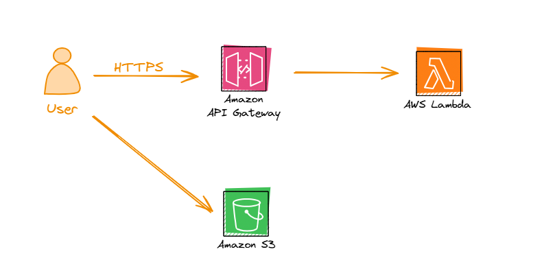

# IaC-three-faces

A project showcasing **one AWS architecture** built using three different Infrastructure as Code (IaC) approaches:
- **AWS CloudFormation**  
- **AWS CDK**  
- **Terraform**

This simple example demonstrates how to deploy an API Gateway, a Lambda function returning “Hello, World!”, and an S3 bucket for static hosting—three essential services commonly used in AWS.

---

## Overview

Each subfolder in this repository contains code for provisioning the **exact same** AWS resources using a different IaC tool. By comparing them side by side, you’ll get a sense of how each tool’s syntax, structure, and deployment workflows differ.

### Why Three Approaches?
- **CloudFormation**: Declarative YAML/JSON configuration, native to AWS.  
- **AWS CDK**: High-level code (TypeScript, Python, etc.) that synthesizes CloudFormation.  
- **Terraform**: Cloud-agnostic approach using HCL, plus multi-cloud capabilities.

---

## Prerequisites

- **AWS CLI** installed and configured (for CloudFormation, plus general AWS interactions)   
- **Python** (for AWS CDK)  
- **Terraform** (for the Terraform approach)  
- **An AWS account** with permissions to create Lambda, API Gateway, and S3 resources  

---

## Architecture



---

### 1. CloudFormation

1. **Navigate** to the `cloudformation` folder:
   ```bash
   cd cloudformation
   ```
2. **Deploy** using the AWS CLI:
   ```bash
   aws cloudformation deploy \
      --template-file template.yaml \
      --stack-name stack-name \
      --capabilities CAPABILITY_NAMED_IAM 
   ```

3. After deployment completes, **retrieve outputs** (API endpoint, S3 website URL):
   ```bash
   aws cloudformation describe-stacks \
    --stack-name stack-name \
    --query "Stacks[0].Outputs
   ```

4. **Test your API Gateway endpoint** (e.g., /hello) and check the S3 static page (if you’ve uploaded index.html).

---


### 2. AWS CDK 

1. **Install the AWS CDK** globally if not already
   ```bash 
   npm install -g aws-cdk
   ```

2. **Navigate** to the `cdk` folder:
   ```bash 
   cd cdk
   ```

3. **Bootstrap** the environment:
   ```bash 
   cdk bootstrap
   ```

4. **Synthesize and deploy**:
   ```bash 
   cdk synth
   cdk deploy
   ```

**Check the deployment outputs** (API endpoint and S3 website URL) in the terminal or the AWS console.

---

### 3. Terraform

1. **Navigate** to the `terraform` folder:
   ```bash 
   cd terraform
   ```

2. **Initialize** Terraform:
   ```bash 
   terraform init
   ```

3. **Plan** your changes (dry-run):
   ```bash 
   terraform plan
   ```

4. **Apply** the configuration:
   ```bash 
   terraform apply
   ```

**Confirm the changes**; Terraform will output the API endpoint and S3 website URL once deployment completes.
   
